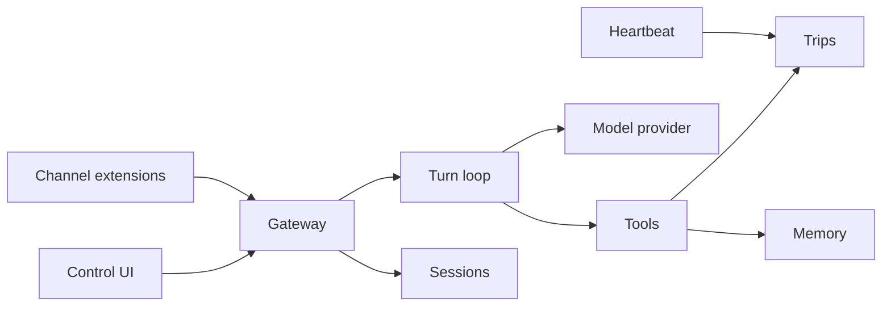

# TravelClaw

A pluggable monolith. One NestJS process is the gateway. The Vite app is the control UI.

[Architecture](docs/architecture.md)

This page restates [docs/architecture.md](docs/architecture.md). If the two disagree, the architecture document wins.

Shared packages hold the contracts and the tool engine so both can be tested without HTTP.

|                                  |                                                                                                                                                                                                                                                                                                                                        |
| -------------------------------- | -------------------------------------------------------------------------------------------------------------------------------------------------------------------------------------------------------------------------------------------------------------------------------------------------------------------------------------- |
| **One gateway**                  | The gateway owns SQLite, HTTP, WebSocket, and scheduling.                                                                                                                                                                                                                                                                              |
| **Control UI**                   | The Vite app talks to the gateway with relative `/api` URLs.                                                                                                                                                                                                                                                                           |
| **Tools, then the model**        | An ordinary turn runs at most three tools. They are TypeScript functions, not markdown. The model asks for them; the router stands in when there is no key or no tool call. Either way they run before the narration, so a missing key cannot invent prices, weather, or a booking.                                                    |
| **Flight desk and Stay desk**    | A flight or hotel request does not go through that tool list. It wakes one or two desks. When a desk finishes, the chat asks: yes complete, no, or still working. That answer does not purchase anything.                                                                                                                              |
| **A pace per model**             | Chat turns are limited **per model and per tier**, in ten-minute windows. A bigger model is rationed tighter than a small one, signing in buys several times a guest's allowance, and running out on one model never takes another away. The numbers live in `apps/api/src/models/model-catalog.ts`; `GET /api/models` publishes them. |
| **What the traveler sees**       | A chat and a sidebar of their chats. The control pages are not the product. Tools are functions we register, called by the model or by the router.                                                                                                                                                                                     |
| **Memory you can read**          | `MEMORY.md` is the human-readable copy. SQLite is the index. Kinds are `preference`, `fact`, and `decision`.                                                                                                                                                                                                                           |
| **Heartbeat**                    | A one-minute cron looks for due jobs. The seeded job is `departure-watch`: trips starting within 14 days. It does not send a chat message. `NO_REPLY` means nothing needed attention.                                                                                                                                                  |
| **Channels as an explicit slot** | Webchat is built in. Telegram and Discord are registered as `not_configured` until a token exists and an adapter is written. Registration is explicit. Autoload is later, because scanning a folder for code is an easy way to run something nobody reviewed.                                                                          |

## How it fits together

| Path                  | Role                                                         |
| --------------------- | ------------------------------------------------------------ |
| `apps/api`            | Gateway. Owns SQLite, HTTP, WebSocket, scheduling.           |
| `apps/web`            | Control UI. Talks to the gateway with relative `/api` URLs.  |
| `packages/shared`     | Wire types and zod schemas. Safe to import from the browser. |
| `packages/agent-core` | Prompt assembly, routing, tools. No Nest, no database.       |
| `workspace/`          | Persona files the gateway reads on every turn.               |
| `extensions/`         | Reserved. Not a workspace glob until a real package exists.  |

## Turns

1. Persist the traveler message.
2. Load persona files, recent memory, and the active trip.
3. Offer the tool catalog to the model, and read the message with the router (triggers on each tool definition, plus a few structured patterns: city + dates, currency pair, "remember").
4. Run at most three tools, model calls and router picks together. A tool both picked runs once. Arguments that do not validate are rejected, not coerced.
5. Ask the model to narrate the tool results. The mock provider returns the desk rendering when no API key is set. If the live model fails, the desk rendering is the reply.
6. Persist the assistant message, each tool trace marked `model` or `router`, and emit `chat.completed`.

A provider hold is a later step, and only after the traveler accepts a real offer.

Skills, in the OpenClaw sense of a `SKILL.md` procedure loaded beside a tool, are not in this version. The desk has a fixed tool list. Add skills later only if a non-code change should alter when a tool runs.

## Sessions

A session key is `agent:<agentId>:<channel>:<peerId>`. Direct webchat uses peer `operator` unless the UI opens a new chat, which gets its own peer id. Group-style channels should use the room id as the peer so histories do not collapse.

## Channels

`ChannelPlugin` in `@travelclaw/shared` is the extension contract. Webchat is built in. Telegram and Discord stay `not_configured` until an adapter is written. Registration lives in `ChannelsService`.

## Memory

On boot, new bullets in `MEMORY.md` are imported. Remembering from chat appends a bullet and a row.

## Heartbeat

The result is stored on the job and shown on the desk. It does not send a chat message.

## Data

Node's built-in `node:sqlite` keeps the gateway free of native addons. The API is still marked experimental by Node, so the start script silences that warning. Schema is applied on boot from `apps/api/src/db/schema.ts`. There is no migration framework yet. If you change columns, delete `data/travelclaw.db` or write a small versioned statement.

## Control UI

`pnpm build` emits `apps/web/dist`. The gateway serves it when that folder exists. In development, Vite proxies `/api`, `/health`, `/docs`, and `/socket.io` to port 3000. The browser never calls localhost.

## Accounts

No sign-up required: opening the desk starts a guest session automatically, and a
guest's chats live on that device. Sign in with an email and password, or with Google
once an operator sets `TRAVELCLAW_GOOGLE_CLIENT_ID`, to keep those chats anywhere —
signing in from a guest session folds them into the account. See
[Accounts](docs/architecture.md#accounts) and [Security](docs/security.md) for how the
cookie session, password hashing, guest promotion, and Google linking work.

## Documentation

| Section                                                                   | What's covered                                                              |
| ------------------------------------------------------------------------- | --------------------------------------------------------------------------- |
| [Why it is split this way](docs/architecture.md#why-it-is-split-this-way) | Gateway, control UI, shared contracts, tool engine, workspace, extensions   |
| [Accounts](docs/architecture.md#accounts)                                 | Email/password, Google sign-in, cookie session, chats scoped to the account |
| [Session keys](docs/architecture.md#session-keys)                         | `agent:<agentId>:<channel>:<peerId>`                                        |
| [Turns](docs/architecture.md#turns)                                       | Persist, route, run tools, narrate, emit `chat.completed`                   |
| [What the traveler sees](docs/architecture.md#what-the-traveler-sees)     | Chat and sidebar. Tools stay internal.                                      |
| [Channels](docs/architecture.md#channels)                                 | Webchat built in. Telegram and Discord not configured.                      |
| [Memory](docs/architecture.md#memory)                                     | `MEMORY.md` plus the SQLite index                                           |
| [Heartbeat](docs/architecture.md#heartbeat)                               | One-minute cron, `departure-watch`, `NO_REPLY`                              |
| [Data](docs/architecture.md#data)                                         | `node:sqlite`, schema on boot, no migration framework                       |
| [Control UI in production](docs/architecture.md#control-ui-in-production) | Gateway serves `apps/web/dist`. Vite proxies in development.                |

## Author

[Sadikdeveloper](https://github.com/Sadikdeveloper) is the author and the only contributor.

## License

[MIT](LICENSE). Copyright (c) 2026 Sadikdeveloper.
