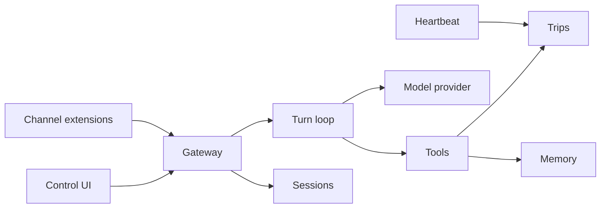

# TravelClaw

A pluggable monolith. One NestJS process is the gateway. The Vite app is the control UI.

[Architecture](docs/architecture.md)

This page restates [docs/architecture.md](docs/architecture.md). If the two disagree, the architecture document wins.

Shared packages hold the contracts and the tool engine so both can be tested without HTTP.

|                                  |                                                                                                                                                                                                                                                                                                                                                                                                    |
| -------------------------------- | -------------------------------------------------------------------------------------------------------------------------------------------------------------------------------------------------------------------------------------------------------------------------------------------------------------------------------------------------------------------------------------------------- |
| **One gateway**                  | The gateway owns SQLite, HTTP, WebSocket, and scheduling.                                                                                                                                                                                                                                                                                                                                          |
| **Control UI**                   | The Vite app talks to the gateway with relative `/api` URLs.                                                                                                                                                                                                                                                                                                                                       |
| **Tools, then the model**        | An ordinary turn runs at most three tools. They are TypeScript functions, not markdown. The model asks for them; the router stands in when there is no key or no tool call. Either way they run before the narration, so a missing key cannot invent prices, weather, or a booking.                                                                                                                |
| **Flight desk and Stay desk**    | A flight or hotel request wakes one or two desks. Configured operator-managed sources are queried in parallel; results name their source and retrieval time, and partial provider failures are disclosed. The traveler may separately ask the source to hold one; it is a hold only after provider confirmation. Nothing is purchased.                                                             |
| **Keys, not code**               | Provider keys are the operator's env, resolved by connector name — `currency`, `weather`, `flight`, and `stay`. Multiple compatible flight or stay adapters can be configured; with none, the desk brief is unchanged. Keys add no traveler setting, prompt text, or model tool.                                                                                                                   |
| **A pace per model**             | The desk runs the strongest model it can run — nobody picks one, guests least of all. A turn limit belongs to a _model_, not the desk: the desk's own model runs here and costs nothing, so it is not paced, while a model with a provider bill carries a per-tier allowance in `apps/api/src/models/model-catalog.ts`. `GET /api/models` publishes both and the model in use.                     |
| **What the traveler sees**       | A chat and a sidebar of their chats, with a process trail under each reply: which tools ran and who asked for them, which desks woke, which model answered. The composer carries an `Agent mode` tag, a stop button while a turn runs, and image/document attach (metadata and thumbnails only — files stay on the device). Tools are functions we register, called by the model or by the router. |
| **Memory you can search**        | `MEMORY.md` is the human-readable copy; SQLite holds the notes and a local FTS5 index over them. Kinds are `preference`, `fact`, and `decision`. `GET /api/memory?q=` ranks by title, body, and recency — no embeddings, no network.                                                                                                                                                               |
| **Heartbeat**                    | A one-minute cron looks for due jobs. The seeded job is `departure-watch`: trips starting within 14 days. It does not send a chat message. `NO_REPLY` means nothing needed attention.                                                                                                                                                                                                              |
| **Channels as an explicit slot** | Webchat is built in. Telegram is ready behind `TELEGRAM_BOT_TOKEN` (polling, no public URL needed); Discord remains `not_configured` until its adapter is written. Registration is explicit. Autoload is later, because scanning a folder for code is an easy way to run something nobody reviewed. |

## How it fits together

```mermaid
flowchart LR
  UI["Control UI"] --> GW["Gateway"]
  EXT["Channel extensions"] --> GW
  GW --> LOOP["Turn loop"]
  LOOP --> TOOLS["Tools"]
  LOOP --> MODEL["Model provider"]
  TOOLS --> TRIPS["Trips"]
  TOOLS --> MEM["Memory"]
  GW --> SES["Sessions"]
  HB["Heartbeat"] --> TRIPS
```

| Path                  | Role                                                                                                               |
| --------------------- | ------------------------------------------------------------------------------------------------------------------ |
| `apps/api`            | Gateway. Owns SQLite, HTTP, WebSocket, scheduling.                                                                 |
| `apps/web`            | Control UI. Talks to the gateway with relative `/api` URLs.                                                        |
| `packages/shared`     | Wire types and zod schemas. Safe to import from the browser.                                                       |
| `packages/agent-core` | Prompt assembly, routing, tools. No Nest, no database.                                                             |
| `workspace/`          | Persona files the gateway reads on every turn. Each agent may override one per file from `workspace/agents/<id>/`. |
| `extensions/`         | Reserved. Not a workspace glob until a real package exists.                                                        |

## Turns

1. Persist the traveler message.
2. Load persona files, the memory that answers the message, and the active trip.
3. Offer the tool catalog to the model, and read the message with the router (triggers on each tool definition, plus a few structured patterns: city + dates, currency pair, "remember").
4. Run at most three tools, model calls and router picks together. A tool both picked runs once. Arguments that do not validate are rejected, not coerced.
5. Ask the model to narrate the tool results. The mock provider returns the desk rendering when no API key is set. If the live model fails, the desk rendering is the reply.
6. Persist the assistant message, each tool trace marked `model` or `router`, and emit `chat.completed`.

A provider hold is a separate, explicit traveler action after an offer is shown. Only a provider confirmation can mark it held; that still does not purchase anything.

Skills, in the OpenClaw sense of a `SKILL.md` procedure loaded beside a tool, are not in this version. The desk has a fixed tool list. Add skills later only if a non-code change should alter when a tool runs.

## Sessions

A session key is `agent:<agentId>:<channel>:<peerId>`. Direct webchat uses peer `operator` unless the UI opens a new chat, which gets its own peer id. Group-style channels should use the room id as the peer so histories do not collapse.

## Channels

`ChannelPlugin` in `@travelclaw/shared` is the extension contract. Webchat is built in. Telegram is implemented behind `TELEGRAM_BOT_TOKEN` (polling adapter in `apps/api/src/channels/telegram/`); Discord stays `not_configured` until its adapter is written. Registration lives in `ChannelsService`.

## Memory

On boot, new bullets in `MEMORY.md` are imported. Remembering from chat appends a bullet and a row; forgetting a note removes both, so the next start cannot bring it back.

Search is local: an FTS5 index over the notes, ranked by `bm25()` with the title weighted above the body, times a bounded recency factor, so an old note that answers the question beats a fresh one that does not. A turn gets the notes that answer it instead of the last twelve, inside the budget it always had. No embeddings, no provider, no network — see [Memory](docs/architecture.md#memory).

## Heartbeat

The result is stored on the job and shown on the desk. It does not send a chat message.

## Data

Node's built-in `node:sqlite` keeps the gateway free of native addons. The API is still marked experimental by Node, so the start script silences that warning. Schema is applied on boot from `apps/api/src/db/schema.ts`. There is no migration framework yet. If you change columns, delete `data/travelclaw.db` or write a small versioned statement.

## Control UI

`pnpm build` emits `apps/web/dist`. The gateway serves it when that folder exists. In development, Vite proxies `/api`, `/health`, `/docs`, and `/socket.io` to port 3000. The browser never calls localhost.

## Accounts

No sign-up required: opening the desk starts a guest session automatically, and a
guest's chats live on that device. Sign in with an email and password, or with Google
once an operator sets `TRAVELCLAW_GOOGLE_CLIENT_ID`, to keep those chats anywhere —
signing in from a guest session folds them into the account. See
[Accounts](docs/architecture.md#accounts) and [Security](docs/security.md) for how the
cookie session, password hashing, guest promotion, and Google linking work.

## Documentation

| Section                                                                   | What's covered                                                                              |
| ------------------------------------------------------------------------- | ------------------------------------------------------------------------------------------- |
| [Why it is split this way](docs/architecture.md#why-it-is-split-this-way) | Gateway, control UI, shared contracts, tool engine, workspace, extensions                   |
| [Accounts](docs/architecture.md#accounts)                                 | Email/password, Google sign-in, cookie session, chats scoped to the account                 |
| [Session keys](docs/architecture.md#session-keys)                         | `agent:<agentId>:<channel>:<peerId>`                                                        |
| [Turns](docs/architecture.md#turns)                                       | Persist, route, run tools, narrate, emit `chat.completed`                                   |
| [What the traveler sees](docs/architecture.md#what-the-traveler-sees)     | Chat and sidebar. Tools stay internal.                                                      |
| [Channels](docs/architecture.md#channels)                                 | Webchat built in. Telegram and Discord not configured.                                      |
| [Connectors](docs/architecture.md#connectors)                             | Operator-held keys. Tools resolve them by name.                                             |
| [Flight and stay search](docs/architecture.md#flight-and-stay-search)     | Parallel compatible providers, source-labeled offers, market caveats, confirmed holds only. |
| [Memory](docs/architecture.md#memory)                                     | `MEMORY.md` plus the SQLite index                                                           |
| [Heartbeat](docs/architecture.md#heartbeat)                               | One-minute cron, `departure-watch`, `NO_REPLY`                                              |
| [Data](docs/architecture.md#data)                                         | `node:sqlite`, schema on boot, no migration framework                                       |
| [Control UI in production](docs/architecture.md#control-ui-in-production) | Gateway serves `apps/web/dist`. Vite proxies in development.                                |

## Author

[Sadikdeveloper](https://github.com/Sadikdeveloper) is the author and the only contributor.

## License

[MIT](LICENSE). Copyright (c) 2026 Sadikdeveloper.

### Optional browser research fallback

When provider search is unavailable or returns no usable offers, an explicitly
configured isolated browser worker can research authorized public search sites.
Chat shows progress/Stop, page-observed evidence and an honest source-link handoff;
page prices are never provider offers or holdable bookings. It is **off by default**.
See [setup and limitations](docs/browser-agent.md) and the
[Hermes/OpenClaw implementation research](docs/browser-research.md).
The real-browser fixtures pass; a permitted live travel-site demonstration is still
required before issue #25 is complete.
