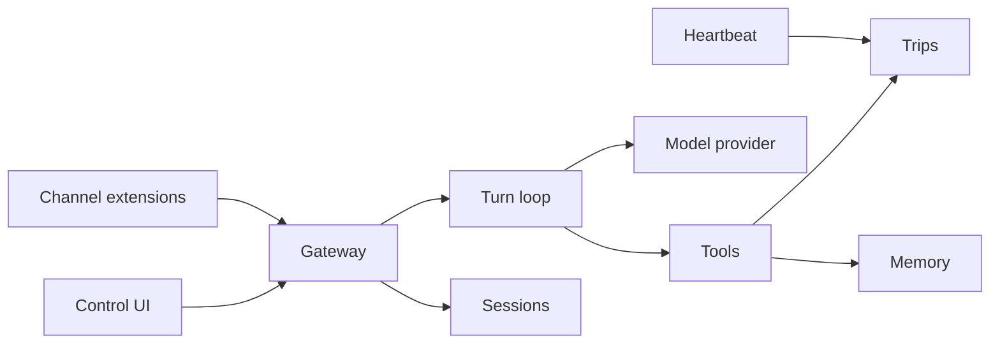

# Architecture

TravelClaw is a pluggable monolith. One NestJS process is the gateway. The Vite app is the control UI. Shared packages hold the contracts and the tool engine so both can be tested without HTTP.

## Why it is split this way

| Path                  | Role                                                         |
| --------------------- | ------------------------------------------------------------ |
| `apps/api`            | Gateway. Owns SQLite, HTTP, WebSocket, scheduling.           |
| `apps/web`            | Control UI. Talks to the gateway with relative `/api` URLs.  |
| `packages/shared`     | Wire types and zod schemas. Safe to import from the browser. |
| `packages/agent-core` | Prompt assembly, routing, tools. No Nest, no database.       |
| `workspace/`          | Persona files the gateway reads on every turn.               |
| `extensions/`         | Reserved. Not a workspace glob until a real package exists.  |

## Accounts

`apps/api/src/auth` owns sign-in. `users` holds email (unique, lowercase), an optional
password hash (`hashPassword`/`verifyPassword` in `auth/password.ts`), an optional
`google_id`, and a display name. Passwords are hashed with Argon2id (OWASP's current
top recommendation) via `hash-wasm` — WebAssembly, zero runtime dependencies, no native
compilation, consistent with this repo's preference for `node:sqlite` over
`better-sqlite3`. A password hashed by an earlier build of this branch with scrypt
still verifies (`isLegacyScryptHash`/legacy path in `password.ts`) and is silently
re-hashed to Argon2id the next time that account signs in successfully — no action
needed from the traveler, and no new scrypt hash is ever minted. Signing in issues an
opaque random token; only its SHA-256 hash is written to `auth_sessions`, and the raw
token goes to the browser as an `HttpOnly`, `SameSite=Lax` cookie
(`travelclaw_session`). `AuthGuard` reads that cookie, looks up the hash, and attaches
the account to the request; routes without the guard stay anonymous, routes with it
401 a signed-out caller.

Chats (`sessions`) carry a `user_id` and every read is filtered by it — a mismatched or
guessed id 404s rather than 403s, so it does not confirm another traveler's chat exists.
Trips, memory, and tools stay desk-wide for now; only chat history is account-scoped.

Google sign-in is `POST /api/auth/google` with the Identity Services `credential` (a
JWT). The gateway verifies its RS256 signature locally against Google's published JWKS
(`https://www.googleapis.com/oauth2/v3/certs`, cached in memory for an hour and
re-fetched on a `kid` miss — see `auth/google-verify.ts`), then checks issuer,
expiry, the audience against `TRAVELCLAW_GOOGLE_CLIENT_ID`, and that the email is
verified. Google's own guidance discourages calling the `tokeninfo` endpoint per login
in production (it is rate-limited and adds a network hop to every sign-in), so this
avoids that endpoint entirely. A first sign-in links to an existing password account
with the same email, or creates one. `GET /api/auth/config` reports whether a client
id is set; the control UI only renders the Google button when it is.

### Guests

Nobody has to sign up to use the desk. On first load the control UI calls
`POST /api/auth/guest`, which — unless the caller already has a valid session, in which
case it just returns that account unchanged — creates a lightweight `users` row with
`is_guest = 1`, no password, and no Google id, and issues it a normal session cookie.
From there a guest is a completely ordinary account to every other route: `sessions`,
`messages`, and `agent_tasks` all key off its `user_id` exactly like a signed-up
traveler's, so chat, tasks, and history all work unmodified. Two differences: turns
from a guest are rate-limited tighter than a real account (`ChatController`, both
per-guest and per-IP, since a guest costs nothing to mint), and the browser mirrors a
guest's chat list and transcripts into `localStorage` (`apps/web/src/guestChatCache.ts`)
purely so the UI paints instantly on reload — the server copy under that guest id
remains the source of truth.

### Sessions that do not depend on a cookie

`SameSite=Lax` HttpOnly cookies are the primary credential, and the reason a browser that
cannot keep them is a real case: in a cross-site iframe or with third-party cookies blocked,
the browser accepts the `Set-Cookie` and never sends it back. Every request then arrives
anonymous, and because the control UI provisions a guest on load, that turns into one new
guest per page load until the mint cap trips.

So sign-in and guest routes also return `sessionToken` in the body, the same opaque token
the cookie carries, and `AuthGuard` accepts it as `Authorization: Bearer`. The cookie wins
when both are present. The web client keeps the token in `localStorage`
(`apps/web/src/sessionToken.ts`) and sends it on every request; on a 401 it re-provisions the
guest, stores the new token, and replays the request once. `localStorage` rather than
`sessionStorage` so a preview that reloads the frame reuses one session instead of minting
another. The token is bearer-style, so an XSS could read it — that is the trade-off, weighed
against a desk that simply does not work in an embedded frame; see `docs/security.md`.

### When the client can keep nothing

A cross-site iframe can hold neither: third-party cookies refused, `localStorage` throwing.
Every request then arrives anonymous, and since the control UI provisions a guest on load,
that is one new guest per request until the per-address mint cap trips — a page that
refreshes a few times can lock its visitor out of a desk they never used.

So the gateway also remembers, in memory, which guest it gave to a browser: the address the
request came from plus its user agent, for twelve hours, extended on each sighting. A caller
that presents no credential at all resumes that guest; a caller with a cookie or bearer token
is resolved by it (the pin is never consulted for a _stale_ token — that is a session that
ended), and signing out forgets the pin. Reloads stop costing an identity, and a guest's
chats survive them.

Because identity can now be inferred from the connection itself, the gateway stops reflecting
arbitrary origins with credentials: same-origin by default, `TRAVELCLAW_ALLOWED_ORIGINS` to
name others. See `docs/security.md` for the trade-off this makes.

### Models and the pace on each

`apps/api/src/models/model-catalog.ts` is the one place that says which models this desk can
run and what each one costs a traveler to use. An entry carries a label, the provider behind
it, and a **turns-per-ten-minutes allowance for each tier** — guest and account. The numbers
are a policy, not a coincidence: the offline desk model is the roomiest, a small live model
sits in the middle, and a big one is rationed tighter, because that is roughly what each
costs to run. A signed-in account's allowance is several times a guest's on every model, which
is the honest answer to "what does signing in get me".

The catalog is built from config. `TRAVELCLAW_MODEL_NAME` is the model a turn runs on when the
request does not name one, and `TRAVELCLAW_MODELS` lists anything else on offer. A live model
is only usable with a provider key; without one it still appears in `GET /api/models` with
`available: false`, so the control UI can show what a key would unlock rather than pretending
the model is not there. The offline desk model is always offered and never needs a key.

A turn may name its model — `POST /api/chat` and `POST /api/sessions/:id/messages` both take an
optional `model`. An id this desk does not run, or one it cannot run, is a `400`
(`model_unknown`, `model_unavailable`) rather than a silent substitution: a traveler who asked
for a specific model is never served by a different one behind their back. The pace check and
the turn resolve the model the same way, off the request, so the limit that applied is the
limit of the model that ran.

Rate limiting itself is one limiter per tier and model, built lazily from the catalog
(`ChatController.limiterFor`), plus one address-wide limiter for guests across all models. The
429 names the model, the allowance, and what would raise it. A model picker in the control UI
is the next step and needs nothing new here: the catalog, the per-model pace, and the request
field are already in place.

A visitor is never sent to a sign-in page. `AuthProvider` handles a failed bootstrap as a
`problem` (`rate_limited` or `unreachable`) and `RequireAuth` renders it with a retry —
an account is optional on this desk, so a pace limit on new guest sessions must not read
as a login wall. A 401 on any non-`/api/auth` route re-provisions the guest session and
replays the request once (`apps/web/src/api.ts`), so a stale cookie is invisible to the
traveler; a real account is never silently downgraded to a guest, and it sees
`That session has expired. Sign in again.` from `AuthGuard`. `Sign in to use this.` is
reserved for a caller that never had a session at all.

When a guest registers, signs in, or completes Google sign-in, its chats are not lost.
`register()`/`loginWithGoogle()` promote the guest's own `users` row into the real
account in place (same id, so its `sessions` rows already point at the right owner —
nothing to move) when there is no separate pre-existing account to reconcile with.
`login()` (and `loginWithGoogle()` linking into an existing account) instead
reassigns the guest's `sessions` rows onto that account's id and deletes the now-empty
guest row (`AuthService.absorbGuest`). Either way, a wrong password never touches the
guest — only a successful sign-in folds it in. The sidebar shows "Sign in" / "Sign up"
for a guest instead of an account name; those pages read `user.isGuest` so a guest
visiting them is not immediately bounced back by the same redirect that would otherwise
skip a signed-in account past the form.

Login and registration are rate-limited per caller (in-memory, resets on restart) to
slow down brute force. A login failure reports the same message whether the email is
unknown, the password is wrong, or the account has no password at all (Google-only) —
anything more specific tells an attacker whether an email is registered.

## Session keys

A session key is `agent:<agentId>:<channel>:<peerId>`. Direct webchat uses peer `operator` unless the UI opens a new chat, which gets its own peer id. Group-style channels should use the room id as the peer so histories do not collapse.

## Turns

1. Persist the traveler message.
2. Load persona files, recent memory, and the active trip.
3. Send the tool catalog to the model and let it ask for the tools it wants. The router also reads the message from triggers on each tool definition, plus a few structured patterns (city + dates, currency pair, "remember").
4. Run at most three tools, counting model calls and router picks together. A tool both picked runs once. They are TypeScript functions, not markdown.
5. Ask the model to narrate the tool results. The mock provider returns the desk rendering when no API key is set. If the live model fails, the desk rendering is the reply.
6. Persist the assistant message, with each trace marked `model` or `router`, and emit `chat.completed`.

A tool call is validated against the tool's zod argument schema before it runs. A payload
that does not match is rejected with a short traveler sentence — never coerced, and never
a 500. The mock provider has no tool support, so it keeps the router-only path: the same
message that works with a key works without one, and a missing key cannot invent prices,
weather, availability, or a booking. The router is also the fallback when a live model
returns no tool call. Either way the tool result is what the model narrates; a runtime
error inside a tool becomes a failed result with the desk still speaking, not a dead turn.

A flight or hotel request does not go through that tool list. It wakes one or two desks, Flight and Stay, and the traveler sees those working. When a desk finishes, the chat asks: yes complete, no, or still working. That answer does not purchase anything. A provider hold is a later step, and only after the traveler accepts a real offer.

## What the traveler sees

The control pages (desk, tools, memory) are not the product. The traveler gets a chat and a sidebar of their chats. Tools are functions we register, and the model calls them with the router as fallback. The traveler does not add tools: a connector is a key, and that is a later step. A traveler signs in (email, then optionally Google) before chatting; chats belong to that account.

Skills, in the OpenClaw sense of a `SKILL.md` procedure loaded beside a tool, are not in this version. The desk has a fixed tool list. Add skills later only if a non-code change should alter when a tool runs.

## Channels

`ChannelPlugin` in `@travelclaw/shared` is the extension contract. Webchat is built in. Telegram and Discord are registered as `not_configured` until a token exists and an adapter is written. Registration is explicit in `ChannelsService`. Autoload is a later task because scanning a folder for code is an easy way to run something nobody reviewed.

## Memory

`MEMORY.md` is the human-readable copy. SQLite is the index the UI lists. On boot, new bullets in the file are imported. Remembering from chat appends a bullet and a row. Kinds are `preference`, `fact`, and `decision`.

## Heartbeat

A one-minute cron looks for due jobs. The seeded job is `departure-watch`: trips starting within 14 days. The result is stored on the job and shown on the desk. It does not send a chat message. `NO_REPLY` means nothing needed attention.

## Data

Node's built-in `node:sqlite` keeps the gateway free of native addons. The API is still marked experimental by Node, so the start script silences that warning. Schema is applied on boot from `apps/api/src/db/schema.ts`. There is no migration framework yet. If you change columns, delete `data/travelclaw.db` or write a small versioned statement.

## Control UI in production

`pnpm build` emits `apps/web/dist`. The gateway serves it when that folder exists. In development, Vite proxies `/api`, `/health`, `/docs`, and `/socket.io` to port 3000. The browser never calls localhost.
