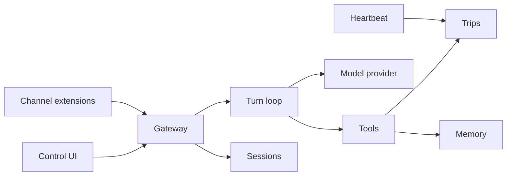

# Architecture

TravelClaw is a pluggable monolith. One NestJS process is the gateway. The Vite app is the control UI. Shared packages hold the contracts and the tool engine so both can be tested without HTTP.

## Why it is split this way

| Path                  | Role                                                         |
| --------------------- | ------------------------------------------------------------ |
| `apps/api`            | Gateway. Owns SQLite, HTTP, WebSocket, scheduling.           |
| `apps/web`            | Control UI. Talks to the gateway with relative `/api` URLs.  |
| `packages/shared`     | Wire types and zod schemas. Safe to import from the browser. |
| `packages/agent-core` | Prompt assembly, routing, tools. No Nest, no database.       |
| `workspace/`          | Persona files the gateway reads on every turn.               |
| `extensions/`         | Reserved. Not a workspace glob until a real package exists.  |

## Session keys

A session key is `agent:<agentId>:<channel>:<peerId>`. Direct webchat uses peer `operator` unless the UI opens a new chat, which gets its own peer id. Group-style channels should use the room id as the peer so histories do not collapse.

## Turns

1. Persist the traveler message.
2. Load persona files, recent memory, and the active trip.
3. Route to at most three tools from triggers on the tool definition, plus a few structured patterns (city + dates, currency pair, "remember").
4. Run those tools. They are TypeScript functions, not markdown.
5. Ask the model to narrate the tool results. The mock provider returns the desk rendering when no API key is set. If the live model fails, the desk rendering is the reply.
6. Persist the assistant message and emit `chat.completed`.

Tools run before the model so a missing key cannot invent prices, weather, or a booking.

Skills, in the OpenClaw sense of a `SKILL.md` procedure loaded beside a tool, are not in this version. The desk has a fixed tool list. Add skills later only if a non-code change should alter when a tool runs.

## Channels

`ChannelPlugin` in `@travelclaw/shared` is the extension contract. Webchat is built in. Telegram and Discord are registered as `not_configured` until a token exists and an adapter is written. Registration is explicit in `ChannelsService`. Autoload is a later task because scanning a folder for code is an easy way to run something nobody reviewed.

## Memory

`MEMORY.md` is the human-readable copy. SQLite is the index the UI lists. On boot, new bullets in the file are imported. Remembering from chat appends a bullet and a row. Kinds are `preference`, `fact`, and `decision`.

## Heartbeat

A one-minute cron looks for due jobs. The seeded job is `departure-watch`: trips starting within 14 days. The result is stored on the job and shown on the desk. It does not send a chat message. `NO_REPLY` means nothing needed attention.

## Data

Node's built-in `node:sqlite` keeps the gateway free of native addons. The API is still marked experimental by Node, so the start script silences that warning. Schema is applied on boot from `apps/api/src/db/schema.ts`. There is no migration framework yet. If you change columns, delete `data/travelclaw.db` or write a small versioned statement.

## Control UI in production

`pnpm build` emits `apps/web/dist`. The gateway serves it when that folder exists. In development, Vite proxies `/api`, `/health`, `/docs`, and `/socket.io` to port 3000. The browser never calls localhost.
