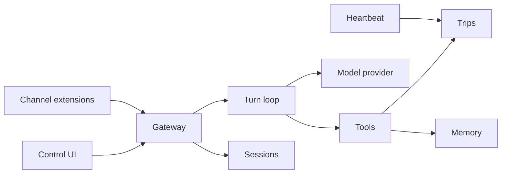

# Architecture

TravelClaw is a pluggable monolith. One NestJS process is the gateway. The Vite app is the control UI. Shared packages hold the contracts and the tool engine so both can be tested without HTTP.

## Why it is split this way

| Path                  | Role                                                         |
| --------------------- | ------------------------------------------------------------ |
| `apps/api`            | Gateway. Owns SQLite, HTTP, WebSocket, scheduling.           |
| `apps/web`            | Control UI. Talks to the gateway with relative `/api` URLs.  |
| `packages/shared`     | Wire types and zod schemas. Safe to import from the browser. |
| `packages/agent-core` | Prompt assembly, routing, tools. No Nest, no database.       |
| `workspace/`          | Persona files the gateway reads on every turn.               |
| `extensions/`         | Reserved. Not a workspace glob until a real package exists.  |

## Accounts

`apps/api/src/auth` owns sign-in. `users` holds email (unique, lowercase), an optional
password hash (`hashPassword`/`verifyPassword` in `auth/password.ts`), an optional
`google_id`, and a display name. Passwords are hashed with Argon2id (OWASP's current
top recommendation) via `hash-wasm` — WebAssembly, zero runtime dependencies, no native
compilation, consistent with this repo's preference for `node:sqlite` over
`better-sqlite3`. A password hashed by an earlier build of this branch with scrypt
still verifies (`isLegacyScryptHash`/legacy path in `password.ts`) and is silently
re-hashed to Argon2id the next time that account signs in successfully — no action
needed from the traveler, and no new scrypt hash is ever minted. Signing in issues an
opaque random token; only its SHA-256 hash is written to `auth_sessions`, and the raw
token goes to the browser as an `HttpOnly`, `SameSite=Lax` cookie
(`travelclaw_session`). `AuthGuard` reads that cookie, looks up the hash, and attaches
the account to the request; routes without the guard stay anonymous, routes with it
401 a signed-out caller.

Chats (`sessions`) carry a `user_id` and every read is filtered by it — a mismatched or
guessed id 404s rather than 403s, so it does not confirm another traveler's chat exists.
Trips, memory, and tools stay desk-wide for now; only chat history is account-scoped.

Google sign-in is `POST /api/auth/google` with the Identity Services `credential` (a
JWT). The gateway verifies its RS256 signature locally against Google's published JWKS
(`https://www.googleapis.com/oauth2/v3/certs`, cached in memory for an hour and
re-fetched on a `kid` miss — see `auth/google-verify.ts`), then checks issuer,
expiry, the audience against `TRAVELCLAW_GOOGLE_CLIENT_ID`, and that the email is
verified. Google's own guidance discourages calling the `tokeninfo` endpoint per login
in production (it is rate-limited and adds a network hop to every sign-in), so this
avoids that endpoint entirely. A first sign-in links to an existing password account
with the same email, or creates one. `GET /api/auth/config` reports whether a client
id is set; the control UI only renders the Google button when it is.

Login and registration are rate-limited per caller (in-memory, resets on restart) to
slow down brute force. A login failure reports the same message whether the email is
unknown, the password is wrong, or the account has no password at all (Google-only) —
anything more specific tells an attacker whether an email is registered.

## Session keys

A session key is `agent:<agentId>:<channel>:<peerId>`. Direct webchat uses peer `operator` unless the UI opens a new chat, which gets its own peer id. Group-style channels should use the room id as the peer so histories do not collapse.

## Turns

1. Persist the traveler message.
2. Load persona files, recent memory, and the active trip.
3. Route to at most three tools from triggers on the tool definition, plus a few structured patterns (city + dates, currency pair, "remember").
4. Run those tools. They are TypeScript functions, not markdown.
5. Ask the model to narrate the tool results. The mock provider returns the desk rendering when no API key is set. If the live model fails, the desk rendering is the reply.
6. Persist the assistant message and emit `chat.completed`.

Tools run before the model so a missing key cannot invent prices, weather, or a booking.

A flight or hotel request does not go through that tool list. It wakes one or two desks, Flight and Stay, and the traveler sees those working. When a desk finishes, the chat asks: yes complete, no, or still working. That answer does not purchase anything. A provider hold is a later step, and only after the traveler accepts a real offer.

## What the traveler sees

The control pages (desk, tools, memory) are not the product. The traveler gets a chat and a sidebar of their chats. Tools are functions we register. The model, or the router until model tool-calling is wired, calls them. The traveler does not add tools in this step. A traveler signs in (email, then optionally Google) before chatting; chats belong to that account.

Skills, in the OpenClaw sense of a `SKILL.md` procedure loaded beside a tool, are not in this version. The desk has a fixed tool list. Add skills later only if a non-code change should alter when a tool runs.

## Channels

`ChannelPlugin` in `@travelclaw/shared` is the extension contract. Webchat is built in. Telegram and Discord are registered as `not_configured` until a token exists and an adapter is written. Registration is explicit in `ChannelsService`. Autoload is a later task because scanning a folder for code is an easy way to run something nobody reviewed.

## Memory

`MEMORY.md` is the human-readable copy. SQLite is the index the UI lists. On boot, new bullets in the file are imported. Remembering from chat appends a bullet and a row. Kinds are `preference`, `fact`, and `decision`.

## Heartbeat

A one-minute cron looks for due jobs. The seeded job is `departure-watch`: trips starting within 14 days. The result is stored on the job and shown on the desk. It does not send a chat message. `NO_REPLY` means nothing needed attention.

## Data

Node's built-in `node:sqlite` keeps the gateway free of native addons. The API is still marked experimental by Node, so the start script silences that warning. Schema is applied on boot from `apps/api/src/db/schema.ts`. There is no migration framework yet. If you change columns, delete `data/travelclaw.db` or write a small versioned statement.

## Control UI in production

`pnpm build` emits `apps/web/dist`. The gateway serves it when that folder exists. In development, Vite proxies `/api`, `/health`, `/docs`, and `/socket.io` to port 3000. The browser never calls localhost.
