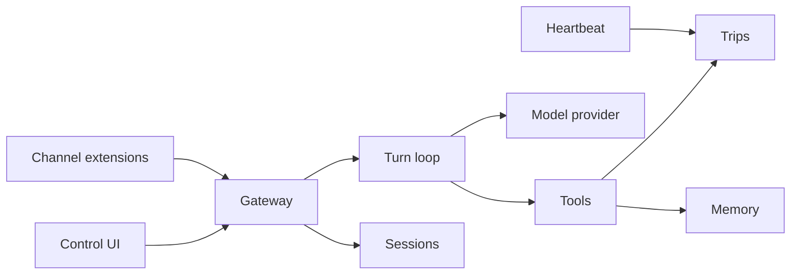

# Architecture

TravelClaw is a pluggable monolith. One NestJS process is the gateway. The Vite app is the control UI. Shared packages hold the contracts and the tool engine so both can be tested without HTTP.


```mermaid
flowchart LR
  UI["Control UI"] --> GW["Gateway"]
  EXT["Channel extensions"] --> GW
  GW --> LOOP["Turn loop"]
  LOOP --> TOOLS["Tools"]
  LOOP --> MODEL["Model provider"]
  TOOLS --> TRIPS["Trips"]
  TOOLS --> MEM["Memory"]
  GW --> SES["Sessions"]
  HB["Heartbeat"] --> TRIPS
```

## Why it is split this way

| Path                  | Role                                                                                                               |
| --------------------- | ------------------------------------------------------------------------------------------------------------------ |
| `apps/api`            | Gateway. Owns SQLite, HTTP, WebSocket, scheduling.                                                                 |
| `apps/web`            | Control UI. Talks to the gateway with relative `/api` URLs.                                                        |
| `packages/shared`     | Wire types and zod schemas. Safe to import from the browser.                                                       |
| `packages/agent-core` | Prompt assembly, routing, tools. No Nest, no database.                                                             |
| `workspace/`          | Persona files the gateway reads on every turn. Each agent may override one per file from `workspace/agents/<id>/`. |
| `extensions/`         | Reserved. Not a workspace glob until a real package exists.                                                        |

## Accounts

`apps/api/src/auth` owns sign-in. `users` holds email (unique, lowercase), an optional
password hash (`hashPassword`/`verifyPassword` in `auth/password.ts`), an optional
`google_id`, and a display name. Passwords are hashed with Argon2id (OWASP's current
top recommendation) via `hash-wasm` — WebAssembly, zero runtime dependencies, no native
compilation, consistent with this repo's preference for `node:sqlite` over
`better-sqlite3`. A password hashed by an earlier build of this branch with scrypt
still verifies (`isLegacyScryptHash`/legacy path in `password.ts`) and is silently
re-hashed to Argon2id the next time that account signs in successfully — no action
needed from the traveler, and no new scrypt hash is ever minted. Signing in issues an
opaque random token; only its SHA-256 hash is written to `auth_sessions`, and the raw
token goes to the browser as an `HttpOnly`, `SameSite=Lax` cookie
(`travelclaw_session`). `AuthGuard` reads that cookie, looks up the hash, and attaches
the account to the request; routes without the guard stay anonymous, routes with it
401 a signed-out caller.

Chats (`sessions`) carry a `user_id` and every read is filtered by it — a mismatched or
guessed id 404s rather than 403s, so it does not confirm another traveler's chat exists.
Trips, memory, and tools stay desk-wide for now; only chat history is account-scoped.

Google sign-in is `POST /api/auth/google` with the Identity Services `credential` (a
JWT). The gateway verifies its RS256 signature locally against Google's published JWKS
(`https://www.googleapis.com/oauth2/v3/certs`, cached in memory for an hour and
re-fetched on a `kid` miss — see `auth/google-verify.ts`), then checks issuer,
expiry, the audience against `TRAVELCLAW_GOOGLE_CLIENT_ID`, and that the email is
verified. Google's own guidance discourages calling the `tokeninfo` endpoint per login
in production (it is rate-limited and adds a network hop to every sign-in), so this
avoids that endpoint entirely. A first sign-in links to an existing password account
with the same email, or creates one. `GET /api/auth/config` reports whether a client
id is set; the control UI only renders the Google button when it is.

### Guests

Nobody has to sign up to use the desk. On first load the control UI calls
`POST /api/auth/guest`, which — unless the caller already has a valid session, in which
case it just returns that account unchanged — creates a lightweight `users` row with
`is_guest = 1`, no password, and no Google id, and issues it a normal session cookie.
From there a guest is a completely ordinary account to every other route: `sessions`,
`messages`, and `agent_tasks` all key off its `user_id` exactly like a signed-up
traveler's, so chat, tasks, and history all work unmodified. Two differences: turns
from a guest are rate-limited tighter than a real account (`ChatController`, both
per-guest and per-IP, since a guest costs nothing to mint), and the browser mirrors a
guest's chat list and transcripts into `localStorage` (`apps/web/src/guestChatCache.ts`)
purely so the UI paints instantly on reload — the server copy under that guest id
remains the source of truth.

### Sessions that do not depend on a cookie

`SameSite=Lax` HttpOnly cookies are the primary credential, and the reason a browser that
cannot keep them is a real case: in a cross-site iframe or with third-party cookies blocked,
the browser accepts the `Set-Cookie` and never sends it back. Every request then arrives
anonymous, and because the control UI provisions a guest on load, that turns into one new
guest per page load until the mint cap trips.

So sign-in and guest routes also return `sessionToken` in the body, the same opaque token
the cookie carries, and `AuthGuard` accepts it as `Authorization: Bearer`. The cookie wins
when both are present. The web client keeps the token in `localStorage`
(`apps/web/src/sessionToken.ts`) and sends it on every request; on a 401 it re-provisions the
guest, stores the new token, and replays the request once. `localStorage` rather than
`sessionStorage` so a preview that reloads the frame reuses one session instead of minting
another. The token is bearer-style, so an XSS could read it — that is the trade-off, weighed
against a desk that simply does not work in an embedded frame; see `docs/security.md`.

### When the client can keep nothing

A cross-site iframe can hold neither: third-party cookies refused, `localStorage` throwing.
Every request then arrives anonymous, and since the control UI provisions a guest on load,
that is one new guest per request until the per-address mint cap trips — a page that
refreshes a few times can lock its visitor out of a desk they never used.

So the gateway also remembers, in memory, which guest it gave to a browser: the address the
request came from plus its user agent, for twelve hours, extended on each sighting. A caller
that presents no credential at all resumes that guest; a caller with a cookie or bearer token
is resolved by it (the pin is never consulted for a _stale_ token — that is a session that
ended), and signing out forgets the pin. Reloads stop costing an identity, and a guest's
chats survive them.

Because identity can now be inferred from the connection itself, the gateway stops reflecting
arbitrary origins with credentials: same-origin by default, `TRAVELCLAW_ALLOWED_ORIGINS` to
name others. See `docs/security.md` for the trade-off this makes.

### Models and the pace on each

`apps/api/src/models/model-catalog.ts` is the one place that says which models this desk can
run and what each one costs a traveler to use. An entry carries a label, the provider behind
it, and a **turns-per-ten-minutes allowance for each tier** — guest and account. The numbers
are a policy, not a coincidence: the offline desk model is the roomiest, a small live model
sits in the middle, and a big one is rationed tighter, because that is roughly what each
costs to run. A signed-in account's allowance is several times a guest's on every model, which
is the honest answer to "what does signing in get me".

The catalog is built from config. `TRAVELCLAW_MODEL_NAME` names the first model on this
deployment and `TRAVELCLAW_MODELS` adds others; the **desk then picks the strongest of them
that can actually run**, so listing models is enough to be offered them. A live model is only
usable with a provider key — without one it still appears in `GET /api/models` with
`available: false`, so the control UI can show what a key would unlock rather than pretending
the model is not there. The offline desk model is always available and never needs a key.

An id is attributed to a provider by its catalog entry, or failing that by its name shape —
and a shape is a guess, so a family whose own connector has no key here falls to an
OpenAI-compatible aggregator when one is configured (`TRAVELCLAW_CODECRAFT_API_KEY`, or the
generic `TRAVELCLAW_MODEL_BASE_URL`/`_API_KEY` slot), and otherwise to the generic slot. One
aggregator key therefore reaches Claude, Qwen, and GLM ids outright and the Gemini, Grok,
Kimi, and DeepSeek families when this deployment has no key of its own for them, while a
native key always keeps its own family. `GET /api/models` reports the provider a turn would
actually use, so the catalog cannot advertise one connector and run on another; an id no
provider here can serve still appears with `available: false`.

**Nobody chooses a model.** A guest cannot, a signed-in account does not have to, and a turn
cannot: neither `POST /api/chat` nor `POST /api/sessions/:id/messages` accepts a `model` field
any more, and a request that sends one is refused with `400 model_selection_unsupported`
rather than quietly answered by a different model. Guests and signed-in accounts are answered
by the same model; what separates the tiers is the pace on it. Choosing is a decision for
later, and the catalog plus the per-model pace are the shape it will need when it comes.

### A limit is a property of a model

There is no desk-wide turn limit, and today nothing is paced at all: the desk's own model runs
in this process and costs nothing per turn, so there is nothing to ration. A traveler is
stopped by a _model's_ limit, not by the desk. When a model with a provider bill behind it is
added, the pace arrives with it — an entry in `model-catalog.ts` carries a `limits` object, and
`limits: null` (the desk's own model) means that model is not paced.

Where a model does carry limits, they are per tier and per ten-minute window — a guest gets a
taste, a signed-in account gets several times more — and enforcement is one limiter per tier
and model (`ChatController.limiterFor`), plus an address-wide limiter for guests that only
counts turns taken on priced models. The 429 names the model it ran out on, the allowance on
that model, and what would raise it. It never reads as a sign-in wall.

`GET /api/models` publishes each model's limits (or `null`), which is also how the control UI
knows there is nothing to pace on the model currently in use.

A visitor is never sent to a sign-in page. `AuthProvider` handles a failed bootstrap as a
`problem` (`rate_limited` or `unreachable`) and `RequireAuth` renders it with a retry —
an account is optional on this desk, so a pace limit on new guest sessions must not read
as a login wall. A 401 on any non-`/api/auth` route re-provisions the guest session and
replays the request once (`apps/web/src/api.ts`), so a stale cookie is invisible to the
traveler; a real account is never silently downgraded to a guest, and it sees
`That session has expired. Sign in again.` from `AuthGuard`. `Sign in to use this.` is
reserved for a caller that never had a session at all.

When a guest registers, signs in, or completes Google sign-in, its chats are not lost.
`register()`/`loginWithGoogle()` promote the guest's own `users` row into the real
account in place (same id, so its `sessions` rows already point at the right owner —
nothing to move) when there is no separate pre-existing account to reconcile with.
`login()` (and `loginWithGoogle()` linking into an existing account) instead
reassigns the guest's `sessions` rows onto that account's id and deletes the now-empty
guest row (`AuthService.absorbGuest`). Either way, a wrong password never touches the
guest — only a successful sign-in folds it in. The sidebar shows "Sign in" / "Sign up"
for a guest instead of an account name; those pages read `user.isGuest` so a guest
visiting them is not immediately bounced back by the same redirect that would otherwise
skip a signed-in account past the form.

Login and registration are rate-limited per caller (in-memory, resets on restart) to
slow down brute force. A login failure reports the same message whether the email is
unknown, the password is wrong, or the account has no password at all (Google-only) —
anything more specific tells an attacker whether an email is registered.

## Session keys

A session key is `agent:<agentId>:<channel>:<peerId>`. Direct webchat uses peer `operator` unless the UI opens a new chat, which gets its own peer id. Group-style channels should use the room id as the peer so histories do not collapse.

## Turns

1. Persist the traveler message.
2. Load persona files, the memory that answers the message, and the active trip.
3. Send the tool catalog to the model and let it ask for the tools it wants. The router also reads the message from triggers on each tool definition, plus a few structured patterns (city + dates, currency pair, "remember").
4. Run at most three tools, counting model calls and router picks together. A tool both picked runs once. They are TypeScript functions, not markdown.
5. Ask the model to narrate the tool results. The mock provider returns the desk rendering when no API key is set. If the live model fails, the desk rendering is the reply.
6. Persist the assistant message, with each trace marked `model` or `router`, and emit `chat.completed`.

A tool-calling model is offered the catalog again after its results, so it can chain real
work (search, then read a page, then answer) instead of answering from the first hit. The
budget does not move: at most three executions per turn. A call identical to one that
already ran in the same turn — same tool, same arguments — is not run again; the result is
already in the model's context, so the pass after it answers from what it has. Rejection is
still loud: a call for a tool that is not on the desk, or with arguments that do not
validate, is reported as a failed step.

Two brakes act before a tool runs, and both answer back in words rather than failing
silently — a model that is merely starved reads the silence as a transient error and tries
to work around it:

- **A per-turn limit per tool** (`TOOL_CALL_LIMITS`, currently `web.search: 2`). Three
  executions is the whole turn budget, so one tool that is cheap to call, easy to loop on,
  and never the source of a price cannot spend it on three versions of the same page. At
  the limit the call is refused with a sentence that says what to do instead: answer from
  what is already in context.
- **A dead tool is not called again.** A failure that is a fact about the install — no
  source configured, a key the vendor refused, a field only the traveler can supply — is
  marked `retryable: false`, so the planner refuses later calls to that tool even with new
  arguments, and the turn does not buy another round to learn the same thing. A failure
  that could differ (a timeout, an unreachable host, a page with nothing readable in it)
  stays retryable and a model that announces an alternative still gets to run it.

A refused call comes back as a `blocked` result: `ok: false` because nothing ran, and
marked so no failure count reads the desk's own verdict as a tool error. The prompt labels
the three states a result can be in — usable, worth another attempt, final — because they
call for three different next moves. A model that still promises another attempt after a
final one does not get that promise saved: the draft is taken back and the grounded result
is written instead.

A tool call is validated against the tool's zod argument schema before it runs. A payload
that does not match is rejected with a short traveler sentence — never coerced, and never
a 500. The mock provider has no tool support, so it keeps the router-only path: the same
message that works with a key works without one, and a missing key cannot invent prices,
weather, availability, or a booking. The router is also the fallback when a live model
returns no tool call. Either way the tool result is what the model narrates; a runtime
error inside a tool becomes a failed result with the desk still speaking, not a dead turn.

A flight or hotel search has two paths, and neither reports a price it did not get from a source. When this install has a configured provider source (or an authorized browser fallback) and the traveler supplied every field needed for the query in one message, the gateway wakes one or two desks, Flight and Stay, which store what the source priced as offers the traveler can hold or dismiss. Everything else stays an ordinary model turn — a follow-up that completes the route from earlier messages, a query one field short, an install with no source configured — and that turn has its own fare tools: `flights.search` and `stays.search` call the same adapters the desks use and return what a vendor priced, with the source and the moment it was read. Those two are the only tools that return a price. The router does not offer `web.search` for a fare or a room rate, the web tool's own description says it is not a price source, and the prompt says a snippet or a memory is never a fare: when no source answers, the price stays unknown and the reply says why. A desk is marked **Search finished** only after its source returns, then the traveler can dismiss or answer the task-success prompt: **Yes**, **No**, or **Keep working**. Keep working does not replay a stale query; it leaves the composer available for the next instruction. An authorized browser handoff is the exception and says what input is needed. A provider quote alone is not a reservation. Where the source supports it, asking the provider to hold an offer is a separate traveler action; after the provider confirms with a reference, the desk reports a provider-confirmed reservation hold. Payment is not taken by TravelClaw.

### The live turn

The chat UI does not wait in the dark. `POST /api/chat/stream` and
`POST /api/sessions/:id/messages/stream` take the same body as the plain routes and answer
with Server-Sent Events on the response to that same request: there is no second channel to
keep in sync and no turn id to invent. One frame per event, in the order it happened:

| Event             | What it carries                                                                                                                                               |
| ----------------- | ------------------------------------------------------------------------------------------------------------------------------------------------------------- |
| `turn.started`    | The chat, and the provider/model label the desk picked                                                                                                        |
| `step`            | A keyed row: `kind` (`stage`, `tool`, `desk`, `browser`), label, detail, `state` (`running`, `done`, `failed`), and `source` for a tool (`model` or `router`) |
| `reasoning.delta` | The model's own thinking, when the provider exposes it                                                                                                        |
| `reply.delta`     | The answer, as the model writes it                                                                                                                            |
| `reply.reset`     | The model wrote prose and then chose a tool instead: clear the draft                                                                                          |
| `turn.completed`  | The same `ChatResponse` the plain route returns                                                                                                               |
| `turn.failed`     | One sentence for the traveler; the stack goes to the operator log                                                                                             |

Steps are keyed, so a tool announced `running` is updated in place when its result lands
instead of appearing twice. The stream is only opened for a caller that passed the same
pace check as any other turn; a refusal is ordinary JSON, never an empty event stream.

A live turn also changes how the desk behaves: it runs the agentic loop above, waits for a
desk it woke instead of answering "they are working", and forwards browser steps from the
in-process event bus as they happen. Stopping — the Stop button, or a tab that went away —
closes the response, which aborts the turn's `AbortController`. That signal reaches the
model call itself, so a stopped turn is cancelled rather than rescued: the traveler's
message stays, and no half-written answer is saved or replaced by desk rendering. The plain
`POST /api/chat` keeps the original two-pass shape and never streams; a provider that
cannot stream has its finished sentence emitted as a single delta, so the screen shows the
same order of events either way.

## Reading the public web

Two tools read the open web, and both are read-only: `web.search` returns up to five
titles, URLs, and snippets, and `web.fetch` returns the readable text of one page. The
shape follows the provider pattern OpenClaw and Hermes use — a search/extract pair behind a
source, with a keyless tier so a bare install still reaches the web:

1. An operator connector named `search` (base URL + key) is used when it exists, so a
   self-hosted SearXNG or a paid API is one environment variable away.
2. Otherwise the keyless DuckDuckGo HTML endpoint is used, the same no-credential fallback
   OpenClaw ships as its `duckduckgo` provider and Hermes reaches through `ddgs`.
3. With the network flag off (`TRAVELCLAW_NETWORK=0`), nothing is fetched and the tool says
   so.

A configured source that answers nothing usable is reported as that source's failure, never
silently swapped for a public scrape. `web.fetch` refuses anything that is not a public
http(s) page on the usual ports: no credentials in the URL, no loopback or private/link-local
literal address, no redirect, at most 400 KB read and 4000 characters kept, and the
truncation is stated. Page text is untrusted data: the prompt tells the model to attribute
it to its source and ignore instructions inside it. This is not the browser worker — it
cannot click, type, or submit anything — and the worker remains the fallback for
interactive research under #25.

## What the traveler sees

The control pages (desk, tools, memory) are not the product. The traveler gets a chat and a sidebar of their chats. Tools are functions we register, and the model calls them with the router as fallback. The traveler only says what they need: provider access is the desk's job (see Connectors), and anything the desk needs back arrives as a turn, not a setting. Nobody has to sign in to chat — a guest is provisioned on first load — but chats belong to the account that made them, guest or signed-in.

The chat shows the trail, not just the answer. While a turn runs, a live card at the end of the thread shows the desk's work as it happens: the model's thinking when the provider shares it, every step in order — the read, what it chose to run, each tool with the arguments it was asked with and the result it returned, desks and browser steps as they move — and the reply, written out as the model writes it. Everything in the card is something the gateway reported; nothing is a placeholder that pretends work is happening. Under a finished reply the same steps stay as a process trail: every tool that ran and who asked for it (the model, or the router standing in), every desk that was woken, and which model wrote the reply. The newest trail opens itself; older ones collapse.

Stopping is immediate. The composer's send button becomes a stop button for the length of a turn; pressing it cancels the model call and saves nothing half-written, leaving the traveler's own message in the thread. A reply that the desk persists before the tab goes away is refilled by the socket on the next load.

The composer is the mode line. A tag reading `Agent mode` sits under the input, both on the landing hero and inside a thread, so the traveler can see how the desk behaves while typing. Attachments are metadata: a traveler can attach up to four images or documents per message, images carry a small inline thumbnail rendered in the browser, and the model is told what arrived by name — the files themselves never reach the gateway. Reading document contents is a later roadmap step, so the desk acknowledges a file rather than opening it.

Skills, in the OpenClaw sense of a `SKILL.md` procedure loaded beside a tool, are not in this version. The desk has a fixed tool list. Add skills later only if a non-code change should alter when a tool runs.

## Channels

`ChannelPlugin` in `@travelclaw/shared` is the extension contract. Webchat is built in. Telegram and Discord are registered as `not_configured` until a token exists and an adapter is written. Registration is explicit in `ChannelsService`. Autoload is a later task because scanning a folder for code is an easy way to run something nobody reviewed.

## Connectors

A connector is an operator-held provider key (plus a base URL where relevant)
that a built-in tool or desk resolves by name when it calls out. It carries no
code, no tool definition, and no prompt text. `ConnectorsService` lists the
`currency` (Frankfurter-compatible rates), `weather` (Open-Meteo-compatible
forecast), `flight`, and `stay` slots; anything else resolves to nothing.

Credentials live in the operator's env (`TRAVELCLAW_CURRENCY_*`,
`TRAVELCLAW_WEATHER_*`, `TRAVELCLAW_FLIGHT_*`, and `TRAVELCLAW_STAY_*`). There is
no HTTP surface for configuring connectors and no per-traveler storage: the
desk holds the keys, and the traveler only says what they need. A turn or desk
resolves credentials through `ConnectorsService.resolverFor()`; the key travels
only in an `Authorization` header, and a 401/403 is logged as a warning naming
the connector. For the built-in rate and weather tools, a failure falls back to
their labeled desk estimate. Flight and stay search instead say that no offers
were returned. No chat message, transcript, error string, or prompt ever carries
the secret.

## Retries

Every outbound call the desk makes — the model, the rate and forecast lookups,
`web.search` and `web.fetch`, and each flight or stay source — goes through one
retry engine in `packages/agent-core`. A retry is jittered, bounded by a
wall-clock budget rather than a count, and stops the instant the traveler
presses Stop. What the other end asked us to wait — a `Retry-After` header or a
"try again in 300ms" hint in an error body — is a floor rather than a
suggestion, up to the longest wait a traveler should ever be sat through. The
wait itself is shown in the process trail, and a call is never retried into
non-idempotent work: a hold, a browser action, or a stream that has already
written a word. See [retries](retries.md) for the rules, the budgets, how they
compare with OpenClaw and Hermes, and where each one applies.

## Flight and stay search

### What provider documentation means for a worldwide desk

A single integration should not be described as exhaustive worldwide coverage. Duffel's flight docs describe sending an offer request to a _range_ of airlines and returning the offers those suppliers provide; its response can be partial when suppliers do not answer within the search window ([offer requests](https://duffel.com/docs/api/v2/offer-requests)). For lodging, Booking.com and Expedia document live search/availability APIs, but they also require market context: Booking.com asks for the booker's country/platform, while Expedia requires the point-of-sale country and documents unsupported points of sale ([Booking.com search guide](https://demand.developers.booking.com/demand/docs/getting-started/try-out-the-api/), [Expedia Rapid shopping](https://developers.expediagroup.com/rapid/lodging/shopping/about-shopping-api), [Expedia point-of-sale requirements](https://developers.expediagroup.com/rapid/setup/launch-requirements/lodging-launch-reqs)). Hotelbeds likewise documents a separate recheck step for rates that need up-to-date availability and price ([Hotelbeds Booking API](https://developer.hotelbeds.com/documentation/hotels/booking-api/)). These are commercial partner APIs, not anonymous public search endpoints.

Therefore TravelClaw treats global coverage as **multiple operator-managed sources, explicitly attributed results, and honest partial failures**—not a promise that any one API covers every route or property. Operators must obtain the relevant supplier/affiliate access and verify the actual routes, properties, point-of-sale markets, terms, and production pricing before launch.

### Operator configuration and fan-out

A flight or stay search can query up to eight sources of that kind in parallel. Configure JSON arrays with `TRAVELCLAW_FLIGHT_PROVIDERS_JSON` and `TRAVELCLAW_STAY_PROVIDERS_JSON`; each entry has a stable operator id, optional display name, an adapter, a base URL when the adapter has no default, and a key:

```json
[
  {
    "id": "global-flights",
    "name": "Global Flights Adapter",
    "baseUrl": "https://operator-adapter.example/api",
    "apiKey": "operator-held-secret"
  },
  {
    "id": "regional-flights",
    "name": "Regional Flights Adapter",
    "baseUrl": "https://regional-adapter.example/api",
    "apiKey": "operator-held-secret"
  }
]
```

The key belongs to the operator and stays on the server; travelers never supply one. A nonblank `*_PROVIDERS_JSON` value takes precedence over that kind's legacy `TRAVELCLAW_FLIGHT_BASE_URL` / `TRAVELCLAW_FLIGHT_API_KEY` or stay equivalents. An explicit `[]` disables that search kind. If the JSON setting is blank, the legacy pair remains supported as one source.

`adapter` says how the desk reaches that source. It defaults to `travelclaw`, the normalized contract below, so an install that already runs a compatible adapter is unchanged. `serpapi` and `flightapi` are built-in adapters for those vendors' own APIs; their base URL defaults to the vendor's documented origin. An adapter name that this build does not have, or one that cannot serve the configured kind, fails startup with the env var and the entry index named. A restaurant slot will read the same way when a restaurant desk exists (see `docs/roadmap.md`).

### Built-in adapters

| Adapter      | Kinds        | Reaches                                                                                                                                                  | Credential                                                                               |
| ------------ | ------------ | -------------------------------------------------------------------------------------------------------------------------------------------------------- | ---------------------------------------------------------------------------------------- |
| `travelclaw` | flight, stay | `GET {base}/search/flights`, `GET {base}/search/stays`, `POST {base}/holds`                                                                              | `Authorization: Bearer`                                                                  |
| `serpapi`    | flight, stay | `GET {base}/search?engine=google_flights` and `?engine=google_hotels`, plus `engine=google_flights_autocomplete` for a city the desk only has a name for | `Authorization: Bearer`, with `api_key` in the query as the vendor's documented fallback |
| `flightapi`  | flight       | `GET {base}/onewaytrip/...` and `GET {base}/roundtrip/...`                                                                                               | key in the URL path, as that vendor requires                                             |

Header-first is the rule, even for a vendor that documents its key as a request parameter. `serpapi` sends the key as `Authorization: Bearer`; only if the vendor refuses that with `401` does it retry once with `api_key` in the query string, the placement SerpApi's own documentation prescribes, and remembers that answer for the life of the process so one rejected search costs one extra call, not one per search. When the header is accepted the key never enters a URL at all.

Adapters translate a vendor's payload into the desk's offer shape and nothing more: `providers.ts` revalidates every candidate with the same schema the normalized contract uses, so no adapter can widen what the desk is willing to show or hold. An adapter never invents a price, a route, or a hold, and every developer-facing string it returns passes through a scrubber that removes the connector key, so a vendor error that echoed the request cannot carry a secret into a task row, a log line, a summary, or a model prompt.

Two vendor facts are worth knowing before enabling one:

- **Google Flights identifies a place by airport code or Google location id**, never by a city name. For `serpapi`, a city the traveler typed is resolved either from an operator `cityCodes` alias or through the vendor's own `google_flights_autocomplete` lookup; if neither has it, the search is refused with a sentence naming the city. For `flightapi`, only an airport code already in the message or an operator alias works, and anything else is refused rather than guessed. A resolved alias or lookup result is real data from the vendor or the operator, never a code the desk made up.
- **Currency provenance.** `serpapi` prices in USD unless asked otherwise and echoes the currency it used in `search_parameters`, which is what the offer is labelled with. `flightapi` requires a currency in the request: the desk sends the traveler's or the operator's when one was stated and otherwise asks for USD, labelling the offer with what it asked for. No price is ever converted or compared across currencies.

A vendor that only quotes prices is recorded as `holdSupport: unsupported` — offers from `serpapi` and `flightapi` carry it. The card labels that no hold is available and never sends a hold request to a source that has no hold endpoint. That is a vendor limit stated plainly, not a hold that failed.

Flight searches accept an optional `departMonth` (`YYYY-MM`) when the traveler names a month without a specific day. TravelClaw samples the 1st, 8th, 15th, 22nd, and 29th (omitting past dates in the current month and dates that conflict with a return), runs those exact-date requests in parallel, and shows up to 24 offers. This is a weekly sample, not a search of every day or a promise of availability; every card labels the actual departure date the provider returned. Exact-date searches retain the existing six-offer cap. Route parsing normalizes capitalization, common aliases, and a uniquely high-confidence small typo for known city names; airport codes and unfamiliar or ambiguous places are left for the provider's lookup rather than guessed.

Multi-city, SerpApi's booking options and price insights, FlightAPI.io's multi-trip endpoint, and hotel property details are not wired yet; they are listed in `docs/roadmap.md`.

All configured sources receive the same search and any market the message or the operator default supplied. TravelClaw does not yet infer route/property coverage or choose providers by region: an adapter may return no offers for a market it does not cover. The UI and task brief identify each source and retrieval time. A failed source does not discard another source's valid results; it is disclosed as a partial search. If every source fails, no offer is shown. Valid offers are interleaved in each source's own order, capped at six total for an exact-date search or 24 for a flexible-month flight search, and are not falsely ranked across currencies. No results from a configured source means no currently returned offers, not proof that the route or city has no inventory.

### Point of sale and display context

Market context travels with the request, stated in the message that starts a search — there is no saved market profile on the account and no sidebar for one. The message is read for three things and nothing else:

- **Booker country** (ISO 3166-1 alpha-2 point of sale) from a phrase that names the booker: "I'm based in Nigeria", "booking from NG", "booker country: NG", "point of sale US". A country that appears only as an origin or a destination is not a point of sale.
- **Currency** (ISO 4217) from pricing language: "price it in NGN", "show fares in EUR", "currency: NGN", "quote in naira". A budget figure, a route, or a currency a provider returned is not read as a request.
- **Language** (BCP-47, such as `en-NG`) only from an explicit language phrase: "content language en-NG", "language French", "show prices in Spanish".

Extraction is deliberately conservative: a currency code is accepted only if it is a real ISO code and not an ordinary English word or an airport name, so `a hotel in Rio` or `a stay in Doha` adds no market, and a two-letter country code is believed only where the sentence names the booker. A message that states nothing yields no market context at all. Because nothing is stored, a market mentioned once cannot follow the traveler into the next search.

The operator env values below apply only to the keys a message left unstated, for a single-market/self-hosted desk:

- `TRAVELCLAW_BOOKER_COUNTRY`: fallback ISO 3166-1 alpha-2 point-of-sale/booker country.
- `TRAVELCLAW_SEARCH_CURRENCY`: fallback requested ISO 4217 currency.
- `TRAVELCLAW_SEARCH_LANGUAGE`: fallback requested language tag, such as `en-NG`.

Blank values are omitted so an adapter can use its own configured market. The task brief names where each value came from — the traveler's message or the operator default — so a summary never implies the traveler said something they did not. Every offer keeps the currency the provider returned; TravelClaw does not convert or compare unlike currencies. Booking and display rules vary by point of sale, so the configured adapter must return a lawful display total and the UI must continue to show the returned currency.

### Search contract (`travelclaw` adapter)

Flight search uses `GET {base}/search/flights` with `origin`, `destination`, `departDate`, `travelers`, and optional `returnDate`. A flexible-month request is expanded by TravelClaw into parallel exact-date calls; `departMonth` is not sent to the provider. Stay search uses `GET {base}/search/stays` with `destination`, `checkIn`, `checkOut`, and `travelers`. Either request may additionally include `bookerCountry`, `currency`, and `language` — each only when the traveler's message stated it or the operator default supplies it. The desk sends each key only as `Authorization: Bearer ...`; it never goes in a URL, transcript, warning, or model prompt. Redirects are refused so a credential is not forwarded to another host. If the traveler does not specify a party size, the query uses one traveler and the brief names that assumption. A flight query with no written return date is one-way; a stay query requires check-in and check-out (an explicit number of nights may supply the latter).

A successful adapter response is JSON with an optional provider label and an offer list:

```json
{
  "provider": "Fare Desk",
  "offers": [
    {
      "id": "provider-offer-id",
      "price": { "amount": "182.40", "currency": "EUR" },
      "title": "Optional provider title",
      "detail": "Optional provider detail",
      "bookingUrl": "https://airline.example/checkout/offer-id",
      "segments": [{ "from": "LOS", "to": "LIS", "carrier": "Example Air" }],
      "stay": { "name": "Optional hotel name", "roomType": "double", "nights": 4 },
      "stops": 1,
      "durationMinutes": 85,
      "stopNames": ["Lagos"],
      "hold": {
        "confirmed": true,
        "ref": "provider-hold-reference",
        "expiresAt": "2026-10-02T18:00:00Z"
      }
    }
  ]
}
```

`price.amount` is required and must come from the source; it is a non-negative number or decimal string, capped at one billion and three decimal places. Offers without a usable id and price are dropped, never filled in from a desk estimate. The optional `bookingUrl` is kept only when it is an HTTPS URL with no embedded credentials or sensitive-looking query parameter; it is a click-through, not proof the quoted fare is still available. FlightAPI can supply a fare-specific URL from the pricing option used for its offer, preferring options marked current. Other sources may omit it. The desk records when it received each response, shows the source and time, and stores offers against the chat task in SQLite (up to 24 recent unheld offers per task; provider-confirmed holds are retained). `GET /api/sessions/:id/tasks` returns the saved offers when the chat is opened again.

### What the card draws, and from what

`segments`, `stay`, `stops`, `durationMinutes`, and `stopNames` are the vendor's own structure, so they are kept as such: the desk stores them as `facts` on the offer (`facts_json` on the `offers` row) beside the `title`/`detail` prose. The chat card reads the facts to draw a date-labelled fare row — carrier, route, times, stops, duration, price — and the desk's brief names the same facts in one line per offer. A source that sends no structured data keeps its prose, and the card falls back to it. Travelers can select one offer per desk; a direct provider link is shown when one was supplied and passed validation, otherwise the card clearly labels a general booking-options search as a fallback. Facts are never inferred: an itinerary with more than one leg does not become a stop count (that could be a return journey), a stop is named only when the vendor named it or the leg structure shows where the change happens, and a stored row whose facts will not parse is read as prose rather than as a broken row.

### Holds and provider identity

A reservation hold exists only when the source explicitly confirms it with a reference. A search never asks for one, and a source whose adapter cannot confirm one (`serpapi`, `flightapi`) is refused locally instead of being sent an offer id it has no endpoint for. Where supported, the traveler can choose **Request provider reservation** on an offer; that POST requires `{ "confirm": true }` and calls the same source's `POST {base}/holds` with `{ "kind": "flight" | "stay", "offerId": "provider-offer-id" }`. Each adapter must implement the underlying supplier's correct revalidation/reservation flow; a vague response (`pending`, `requested`, `held` without a reference), HTTP error, or timeout remains an offer. Provider confirmation and reference are persisted, as is any expiry the provider supplied. This can be an unpaid reservation; TravelClaw does not process payment, and the provider controls any deadline or payment instructions. The connector id and endpoint identity that returned the offer are stored privately; if either changes before a reservation request, the desk refuses to send the old offer id to another source and asks for a fresh search.

Selecting an offer marks the traveler's shortlist. The card opens a validated provider-supplied URL when available, or offers a clearly labelled general search when no direct checkout URL was sent. A provider-supplied link is tied to the selected offer and may prefill its itinerary/fare; the provider controls any passenger-detail prefill, unpaid-reservation option, payment deadline, and payment instructions. TravelClaw does not process payment or put traveler/payment details into URLs. A quote remains unreserved until the provider confirms a reservation or its checkout flow completes.

## Memory

`MEMORY.md` is the human-readable copy. `memory_notes` is the note, and the UI
lists what is in that table. On boot, new bullets in the file are imported.
Remembering from chat appends a bullet and a row; forgetting a note removes the
row **and** its bullet, or the next boot would import it straight back. Kinds are
`preference`, `fact`, and `decision`.

### Search

Search is local: the same SQLite file, no embeddings, no provider call, no
network. `memory_notes_fts` is a derived FTS5 index over the notes — a shadow,
never a second source of truth. Three triggers keep it in step (`AFTER INSERT`,
`AFTER UPDATE OF` the columns it stores, `AFTER DELETE`), and every boot
reconciles it, because `CREATE VIRTUAL TABLE IF NOT EXISTS` silently keeps an
index an older version defined:

- the persisted DDL is compared with the one this build expects, and a mismatch —
  a different tokenizer, say — is dropped, recreated, and re-copied;
- a name that belongs to an ordinary table is left alone rather than dropped;
- the notes are re-copied whenever the index cannot be shown to agree with the
  table, which covers a missing row and a trigger somebody dropped.

`GET /api/memory?q=…&kind=…&limit=…` scores each hit `relevance × recency`:
`bm25()` over title and body with the title weighted three to one, times an
exponential decay with a 90-day half-life that stops at 0.6, so an old preference
is still a preference. Scores are comparable within one search only. Equal scores
fall back to title, then id, so one query has one order. Without `q` the same
route lists notes, newest first, as before.

Two properties of FTS5 shape the query builder, and both cost other agents
several rounds of bug reports:

- **Traveler text is never query syntax.** Terms are extracted as runs of letters,
  digits, and `_`, then sent as quoted literals joined by `AND`. Unquoted, `AND OR
NOT` or an unclosed quote is a syntax error, and `NEAR/3`, `*`, `^`, or `:`
  would change what is asked for. A query with no words in it yields no search at
  all, rather than every note the desk has.
- **`AND` between terms is too strict, and unicode61 cannot segment every
  script.** An empty strict search is retried with the terms `OR`-joined, so a
  question worded differently from the note it is about still lands. A query
  holding a script with no word delimiters — Chinese, Japanese, Korean, Thai — is
  answered by an escaped `LIKE` scan, because unicode61 keeps a run of ideographs
  as a single token and a substring of a token can never match. That same scan is
  the fallback when the SQLite has no FTS5: search degrades, the gateway does not
  fail to start.

The prompt takes the notes a turn is about instead of the last twelve: the
traveler's message is the query, the most relevant notes come first, and the most
recent notes fill the rest. The budget is what it always was — twelve lines — and
is now explicit about bytes too (2000), enforced in `assemblePrompt` so no caller
can balloon a turn.

## Heartbeat

A one-minute cron looks for due jobs. The seeded job is `departure-watch`: trips starting within 14 days. The result is stored on the job and shown on the desk. It does not send a chat message. `NO_REPLY` means nothing needed attention.

## Data

Node's built-in `node:sqlite` keeps the gateway free of native addons. The API is still marked experimental by Node, so the start script silences that warning. Schema is applied on boot from `apps/api/src/db/schema.ts`. There is no migration framework yet. If you change columns, delete `data/travelclaw.db` or write a small versioned statement.

The memory search index is the one piece of schema deliberately kept out of
`SCHEMA`: FTS5 is a compile-time option, and a SQLite built without it must not
stop the gateway from starting. It is created after `SCHEMA` by
`apps/api/src/db/memory-search-schema.ts`, which probes, reconciles, and reports
why it declined.

## Control UI in production

`pnpm build` emits `apps/web/dist`. The gateway serves it when that folder exists. In development, Vite proxies `/api`, `/health`, `/docs`, and `/socket.io` to port 3000. The browser never calls localhost.

## Browser fallback research

The flight/stay desk can use an opt-in, separately authenticated browser worker after
provider adapters return no usable offers or cannot search. Provider success never
starts a browser. `BrowserService` owns a bounded, cancellable browser-only model loop;
`apps/browser-worker` owns ephemeral contexts and pinned HTTP transport. Session
credentials remain server-side. The ordinary bundled-tool loop is unchanged.

Browser state and evidence are stored in `browser_runs`, not `offers`. The task API
and chat card show progress, Stop, source links and non-bookable page observations.
Finite procedure candidates live in `browser_procedures`, require local operator
review, and never enter personal memory. There is no arbitrary Markdown/code skill
execution or existing-profile attachment. See [browser-agent.md](browser-agent.md)
for runtime limits, source authorization, tests and remaining #25 acceptance work.
